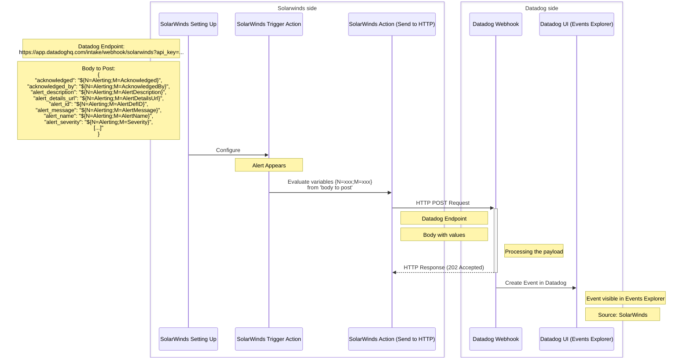

# datadog-solarwinds-events
Solarwinds/Datadog integration diagram: https://docs.datadoghq.com/integrations/solarwinds/

```mermaid
sequenceDiagram
    box Solarwinds side
    participant Setup as SolarWinds Setting Up
    participant TriggerAction as SolarWinds Trigger Action
    participant SendHTTP as SolarWinds Action (Send to HTTP)
    end
    box Datadog side
    participant DatadogWebhook as Datadog Webhook
    participant DatadogUI as Datadog UI (Events Explorer)
    end
    Note left of Setup: Datadog Endpoint:<br/> https://app.datadoghq.com/intake/webhook/solarwinds?api_key=...
    Note left of Setup: Body to Post:<br/>{<br/>                                                                                                             "acknowledged": "${N=Alerting#59;M=Acknowledged}",<br>   "acknowledged_by": "${N=Alerting#59;M=AcknowledgedBy}",<br>   "alert_description": "${N=Alerting#59;M=AlertDescription}",<br>   "alert_details_url": "${N=Alerting#59;M=AlertDetailsUrl}",<br>   "alert_id": "${N=Alerting#59;M=AlertDefID}",<br>   "alert_message": "${N=Alerting#59;M=AlertMessage}",<br>   "alert_name": "${N=Alerting#59;M=AlertName}",<br>   "alert_severity": "${N=Alerting#59;M=Severity}",<br> [...]"<br>}
    Setup->>TriggerAction: Configure
    Note over TriggerAction: Alert Appears
    TriggerAction->>SendHTTP: Evaluate variables {N=xxx#59;M=xxx}<br/> from 'body to post'
    SendHTTP->>+DatadogWebhook: HTTP POST Request
    Note right of SendHTTP: Datadog Endpoint
    Note right of SendHTTP: Body with values
    Note right of DatadogWebhook: Processing the payload
    DatadogWebhook-->>-SendHTTP: HTTP Response (202 Accepted)
    DatadogWebhook->>DatadogUI: Create Event in Datadog
    Note right of DatadogUI: Event visible in Events Explorer
    Note right of DatadogUI: Source: SolarWinds
```
